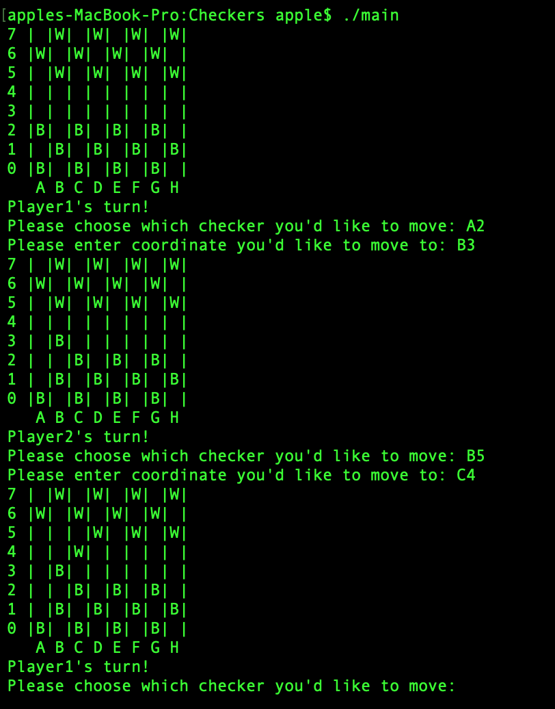

# Checkers

Implemented a Command Line Interface (CLI) based board game in C.

## Installation
Please clone the repository and execute the following commands to run the game: 

```
git clone https://github.com/hshastri/Checkers.git
cd Freedom;
sudo gcc -0 main main.c;
./main
```

## Game Demo

This is how the game looks like:

